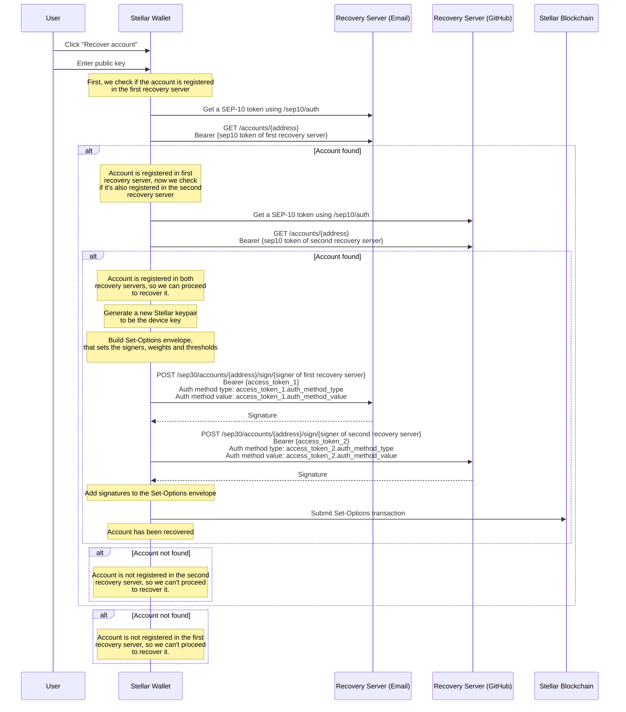

# BPV Stellar Blockchain SEP-30 Key Management Documentation

This repository contains documentation for BP Ventures Stellar XLM SEP-30 implementation.  
Stellar has [a reference implementation in Golang](https://github.com/stellar/go/tree/master/exp/services/recoverysigner),
but it's tightly integrated with Firebase and Twilio.  
BPV's SEP-30 implementation is more flexible and allows many types of authentication,
including Email, GitHub, and other social providers (Apple, Github, Google, Facebook, Microsoft).

### Motivation & Special features

Although recovery using email or phone is very common, it's not always available or reliable.  
Phone registration/recovery is usually done by sending an SMS with a code to the user. SMS is a widely available option, but it can get very expensive, as sending a SMS sometimes can cost a few dollars, specially when sending between different countries.
Email is also widely available, but there can be issues as well (it's not uncommon for emails to not get received by the recipient).
To take advantage of the many modern authentication mechanisms of today, we at BPV developed a SEP-30 recovery server that supports many different types of authentication:
- Email + code
- Email + password (with email confirmation link)
- Phone + SMS code
- Social logins (GitHub, Facebook, etc)
- TOTP (in development)
- ...and many others are planned to be added

This gives Wallets a rich set of options for deciding which recovery method to provide for their users. By using BPV SEP-30 server you also get access to our consulting services and development support.

### Playground
- [Playground 🔗](https://sep30-demo.bpventures.us/)
- [How to use the playgroind](#stellar-sep-30-playground-wallet-registration)
  
### Other links
- [The Future of UI & Key Management for Blockchain wallets in 2024](https://p.bpventures.us/blog/the-future-of-ui-and-keymanagement-for-blockchain-wallets-in-2024/)
- [SEP-30 Specification 🔗](https://github.com/stellar/stellar-protocol/blob/master/ecosystem/sep-0030.md)
- [Registration Flow](#stellar-wallet-registration-flow)
- [Recovery Flow](#stellar-wallet-recovery-flow)
- [Stellar Article](https://stellar.org/blog/developers/sep-30-recoverysigner-user-friendly-key-management)
- [Stellar Youtube presentation](https://www.youtube.com/watch?v=wpB6ZT2aOFs)
- [User Friendly Key Management with SEP-30 Recoverysigner](https://leighmcculloch.com/talks/user-friendly-key-management-with-sep-30-recoverysigner/)
- [SEP-30 & the Importance of Key-Management and Recovery](https://leighmcculloch.com/talks/sep-30-and-the-importance-of-key-management-and-recovery/)
- [Stellar Presentation Notes](https://leighmcculloch.com/talks/user-friendly-key-management-with-sep-30-recoverysigner/Slides%20and%20Notes.pdf)

### Stellar SEP 30 Playground Wallet Registration
- Click New Account
- Click Fund account to receive Stellar XLM 
- Copy the Connected account Key Pair to a text editor for temporary storage
- Click Configure severs
- click Register 1 (email)
- confirm your email
- Click Register 2 (Github) - Note in production this can be Google Authenticator (OTP), Github, Apple, Google or one of many other services
- Sign in to the social account
- Note for this process there will not be a device key generated - we may do so in the future
- We do not support SMS or phone number in this version as we have found the costs may outweigh the benefits to send SMS to some developing countries

### Stellar SEP30 Wallet Recovery Process
- basically SHIFT + CTRL + R to clear the browser
- copy in the public key (note in production they can recover using email address and not just public key)
- follow the recovery steps which are pretty self evident

Other notes:
- for support or feedback please email support@bpventures.us
- We would love to support you on your next project!

## Plans for this Project
- add additional social logins
- Potentially Passkey Biometric login (Face/Fingerprint)

   
## Stellar Wallet Registration Flow

This flow assumes:
- A Stellar Wallet compatible with SEP-30 and pre-configured to use two BPV SEP-30 recovery servers
- Two BPV SEP-30 recovery servers deployed:
  - First one requires Email authentication
  - Second one requires GitHub authentication

```mermaid
sequenceDiagram
    participant U as User
    participant W as Stellar Wallet
    participant RS1 as Recovery Server (Email)
    participant RS2 as Recovery Server (GitHub)
    participant S as Stellar Blockchain
    U->>W: Clicks "New Wallet"
    U->>W: Clicks "Register"
    Note over W: Now, we need to register in the first<br>recovery server, which<br>requires email authentication.
    W->>RS1: POST /authorize/token
    RS1-->>W: id + token
    W->>RS1: Open popup pointing to /authorize/?token={token}
    W->>RS1: (loop every 1s) GET /authorize/token/{id}
    alt User not registered
    U->>RS1: Click "Sign-up"
    U->>RS1: Fill email+password & Submit form
    Note over RS1: Confirmation email has been sent
    U->>RS1: Close page
    U->>RS1: Clicks link sent to email
    U->>RS1: Click "Confirm email"
    Note over RS1: Email confirmed
    U->>RS1: Close page
    U->>W: Clicks "Register via Email"
    W->>RS1: Open popup pointing to /authorize/?token={token}
    U->>RS1: Click "Sign-in"
    U->>RS1: Fill email+password & Submit form
    U->>RS1: Click "Authorize"
    Note over RS1: Redirect to /account/logged-in<br>and inform user he can close the page.
    end
    alt User not logged in
    U->>RS1: Click "Sign-in"
    U->>RS1: Fill email+password & Submit form
    U->>RS1: Click "Authorize"
    Note over RS1: Redirect to /account/logged-in<br>and inform user he can close the page.
    end
    alt User logged in
    U->>RS1: Click "Authorize"
    Note over RS1: Redirect to /account/logged-in<br>and inform user he can close the page.
    end
    Note over W: At this point, the "GET /authorize/token/{id}"<br>will contain access_token (let's call it access_token_1),<br>which is a<br>JWT with some information
    Note over W: Stop calling GET /authorize/token/{id}
    Note over W: Now, we need to register in the second<br>recovery server, which<br>requires GitHub authentication.
    W->>RS2: POST /authorize/token
    RS2-->>W: id + token
    W->>RS2: Open popup pointing to /authorize/?token={token}
    W->>RS2: (loop every 1s) GET /authorize/token/{id}
    alt User not registered
    U->>RS2: Click "Sign-in with GitHub"
    U->>RS2: Authorize GitHub access
    Note over RS2: Redirect to /account/logged-in<br>and inform user he can close the page.
    end
    alt User not logged in
    U->>RS2: Click "Sign-in with GitHub"
    U->>RS2: Authorize GitHub access
    Note over RS2: Redirect to /account/logged-in<br>and inform user he can close the page.
    end
    alt User logged in
    U->>RS2: Authorize GitHub access
    Note over RS2: Redirect to /account/logged-in<br>and inform user he can close the page.
    end
    Note over W: At this point, the "GET /authorize/token/{id}"<br>will contain access_token (let's call it access_token_2),<br>which is a<br>JWT with some information
    Note over W: Stop calling GET /authorize/token/{id}
    W->>RS1: POST /sponsor/new<br>Bearer {access_token_1}
    RS1-->>W: Signed envelope to sponsor the account
    W->>S: Submit transaction
    Note over W: Account is sponsored (funded)
    Note over W: Now we need to get SEP-10 tokens from both recovery servers
    W->>RS1: Get SEP-10 token using /sep10/auth
    W->>RS2: Get SEP-10 token using /sep10/auth
    Note over W: Now, we check if the account is already<br>registered in the first recovery server
    W->>RS1: GET /accounts/{address}<br>Bearer {sep10 token}
    alt Account not found in first recovery server
        Note over W: Account not found in first recovery server,<br>this is expected, so we check<br>if the account is already registered in the second<br>recovery server
        W->>RS2: GET /accounts/{address}<br>Bearer {sep10 token}
        alt Account not found in second recovery server
            Note over W: Account not found in second recovery server,<br>this is expected, so we proceed<br>to register it in both servers.
            W->>RS1: POST /sep30/accounts/{address}<br>Bearer {access_token_1}<br>Auth method type: access_token_1.auth_method_type<br>Auth method value: access_token_1.auth_method_value
            RS1-->>W: Account info, including generated signer pubkey
            W->>RS2: POST /sep30/accounts/{address}<br>Bearer {access_token_2}<br>Auth method type: access_token_2.auth_method_type<br>Auth method value: access_token_2.auth_method_value
            RS2-->>W: Account info, including generated signer pubkey
            W->>S: Submit Set-Options transaction and add<br>the signers obtained from both recovery servers
        end
        alt Account found in first recovery server
            Note over W: If we get here it means the account is not registered<br>in the first recovery server,<br>but is registered in the second recovery server.<br>In this case we can't proceed, so we<br>inform the user he needs to recovery the account<br>.
        end
    end
    alt Account found in first recovery server
        Note over W: Account found in first recovery server,<br>so we check if the account is registered<br>in the second recovery server.
        W->>RS2: GET /accounts/{address}<br>Bearer {sep10 token}
        alt Account found in second recovery server
            Note over W: If we get here, it's all as expected,<br>account is registered in both recovery servers.
            W->>U: Display signer info
        end
        alt Account not found in second recovery server
            Note over W: If we get here it means the account is registered<br>in the first recovery server,<br>but is not registered in the second recovery server.<br>In this case we can't proceed, so we<br>inform the user he needs to recover the account<br>.
        end
    end
```

## Stellar Wallet Recovery Flow

This flow assumes:
- A Stellar Wallet compatible with SEP-30 and pre-configured to use two BPV SEP-30 recovery servers
- Two BPV SEP-30 recovery servers deployed:
  - First one requires Email authentication
  - Second one requires GitHub authentication
- User is already registered in both recovery servers and wants to recover a given pubkey

